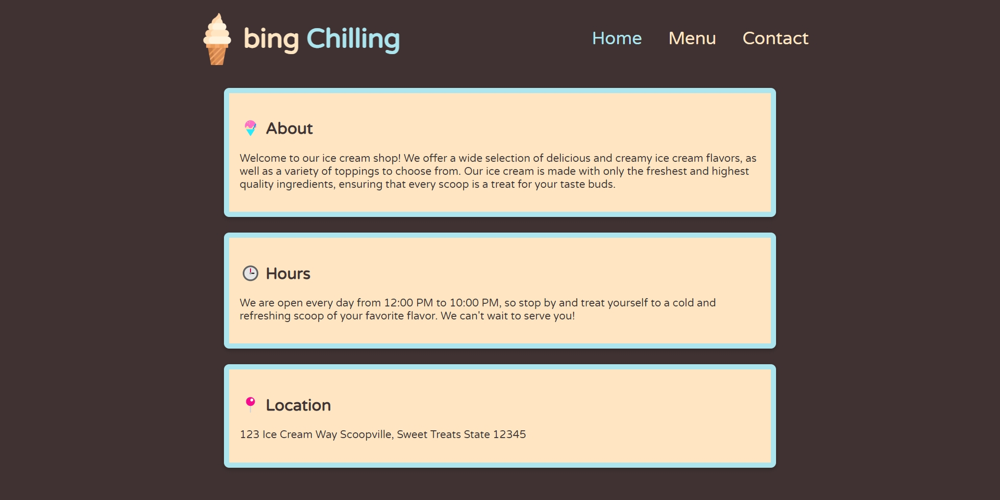
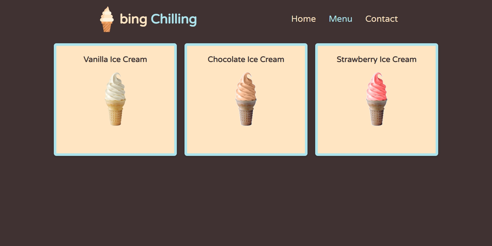
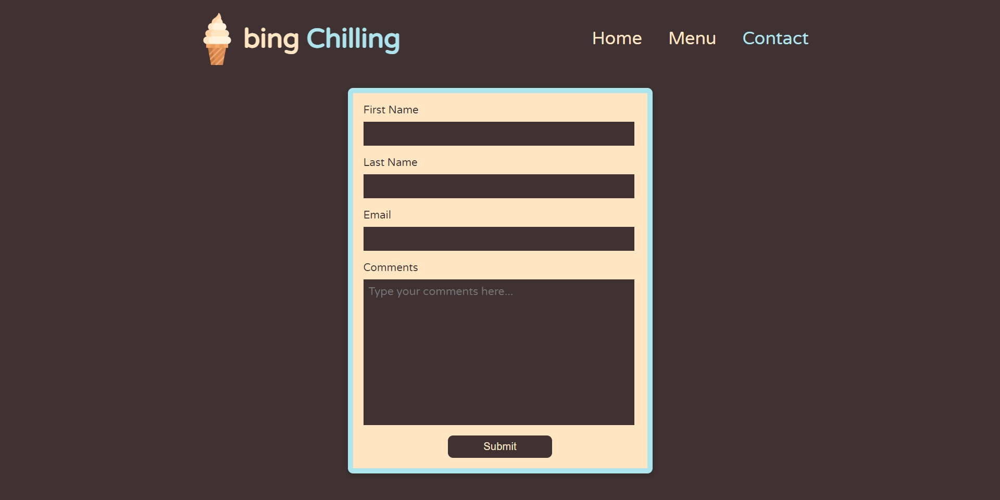

# Ice Cream Store Website

## Summary

A simple ice cream store website, I made to challenge my HTMl, CSS and Javascript skills.

## Learning Outcomes

- Used webpack to transpile and bundle my code
- Used Javascript to render the HTML dynamically
- Used ES6 modules to import and export different components of the page

## Homepage

## Menu

## Contact

